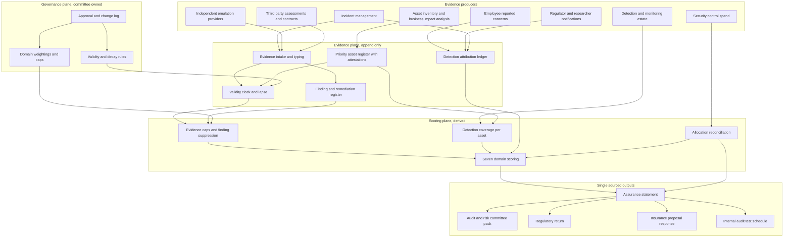

# Vouchstone

**Source:** `ai-in-cyber/Accenture-Security-Report-2016_Key-Insights_SPAIN-esp/`
**Domain:** `ai-cyber`
**One-liner:** A cyber assurance ledger that lets a CISO state a security posture only as high as the evidence behind it, tracks who actually discovered each successful attack, and makes the board-facing score fall automatically when the evidence expires.
**Wedge:** Iberian enterprises above one billion dollars of revenue in regulated sectors — banking, insurance, energy and water utilities, and telecommunications — where a named executive signs an annual cyber assurance statement that reaches an audit and risk committee, a sector regulator, and a cyber-insurance proposal form.
**Positioning:** Evidenced cyber assurance, as distinct from cyber maturity assessment. A maturity assessment scores what the security function says about itself, once a year, on a self-reported scale, and produces a spider chart that only ever improves. Vouchstone scores only what can be shown, dates every piece of evidence, and lets the score decay when that evidence goes stale. The source makes the case for exactly this instrument: it documents an organisation that is confident and unprepared at the same time, and it names the resolution as *confianza justificada* — justified confidence — which is a measurement problem before it is a security problem.

## Market research synthesis

### Thesis from source

The report is built on a hybrid online and telephone survey of 2,000 security executives, of whom 124 were Spanish, at companies with minimum revenues of one billion dollars across a spread of regions and industries. Its purpose was to establish what priority firms give to cybersecurity, what their security plans look like, and where they intend to invest. Spanish results are quoted first throughout, with the global figure in parentheses, and the gap between the two is itself informative.

Its central finding is a contradiction, which the report titles *contradicciones por doquier* — contradictions everywhere. On one side, 69% (75%) of respondents express confidence in their cybersecurity strategy, and 79% (70%) assert that cybersecurity forms part of their organisation's culture and enjoys senior executive support — a figure on which Spain leads the global average, suggesting the problem is not executive indifference. On the other side, the same organisations absorb an average of 94 (106) targeted attacks a year, of which one in three reaches its objective. The report converts that into the number that should end the conversation: two to three successful attacks per month, every month, at firms that believe their strategy is sound.

Detection is worse than the attack rate. 59% (51%) of respondents admit it takes *months* to identify an attack, and a further 5% (17%) need a year or more. And when a successful attack is found, the security team is not reliably the finder: security teams detect only 68% (65%) of successful attacks, with the remainder identified mostly by other employees, by the authorities, and by ethical hackers. On this point agreement is total — 100% (98%) of respondents concur that it is usually employees who discover the attacks that slipped past the security team. The report draws the operational conclusion that staff are the firm's first line of defence and that training and identification of the best-prepared employees should be a priority.

The misallocation finding is the one with a budget attached. 43% (50%) of respondents believe internal attacks have the greatest impact on cybersecurity, and 57% (62%) confess they do not trust their organisation's internal controls to detect possible attacks. Yet 48% (58%) prioritise strengthening perimeter controls rather than giving more attention to internal threats. Belief about impact and allocation of effort point in opposite directions, and nothing in the reporting apparatus forces anyone to notice. The report's counter-argument is a genuine asymmetry in the defender's favour: attackers know what they want but generally do not know where to find it, while security professionals have the advantage of knowing which assets need protecting — so concentrating on those assets is how firms confront insider attacks, which carry greater impact while being relatively less numerous.

The report then supplies the two structures a measurement product needs. First, five questions it proposes as a new definition of success: are you confident you have identified all your priority assets *and their location*; could you defend the organisation against a fully determined adversary; do you possess the precise tools and techniques to respond to an attack; do you know what your adversary is actually looking for; and how often does your organisation *practise* the plan in order to improve its response. Every one is falsifiable, and the last is a cadence rather than a state. Second, seven cybersecurity domains against which barely a third of respondents are confident in their capabilities: risk exposure, which weighs which incidents would hit hardest; governance and leadership, which assigns responsibilities, fosters a security culture, monitors results, incentivises employees, and defines a cybersecurity chain of command; strategic context, which explores possible threats so the security programme tracks business strategy; resilience, the capacity to maintain operational excellence while under attack; response capability, meaning a solid response plan, a working incident notification system, tested protection and recovery plans for key assets, effective incident escalation paths, and the ability to involve stakeholders across every business function; the extended ecosystem, which must be ready to collaborate in a crisis, must define third-party cybersecurity clauses and agreements, and must guarantee compliance with cybersecurity regulation; and efficient investment, which must justify spending across all domains and guarantee the allocation of funds and resources.

Its recommendations are consistent with treating this as an evidence problem. Test the defences, using external ethical hackers as *sparrings* — sparring partners — so leaders can determine whether their teams are ready for a real fight. Protect from the inside, by concentrating on the assets you already know matter. And win leadership backing, which the report frames bluntly: CISOs must leave their comfort zone of compliance audits and technology, maintain daily contact with business leaders, and speak the language of business to explain that the security team is a basic pillar in safeguarding enterprise value. The closing promise is that organisations tying cybersecurity to real business needs will acquire the confidence needed to face any threat. The operative word is *acquire*. Confidence is meant to be earned and evidenced, not asserted on a survey.

### Buyer & economic model

- **Primary buyer:** the CISO, who signs the assurance statement and carries the personal exposure if it is wrong. The economic buyer is frequently one step out: the chair of the audit and risk committee, or the CFO who signs the cyber-insurance proposal form and the regulatory return.
- **Users:** the CISO and their assurance lead; the security operations manager who owns detection coverage and time-to-detect; the adversary emulation or purple team lead who commissions and receives the sparring exercises; business-line asset owners who attest to priority assets and their location; incident response leads who classify severity and run escalation; internal audit, who test the ledger rather than rebuild it; legal and the insurance broker who rely on the statement; and the committee secretary who packages board reporting.
- **Budget owner / value metric:** the security assurance and governance budget, augmented by whatever the firm currently pays a consultancy for its annual maturity assessment and by the risk-transfer budget behind the cyber policy. The value metric is the share of the posture statement that is evidence-backed rather than asserted, together with the two figures the source shows nobody currently measures honestly: measured rather than estimated time to detect, and the share of successful attacks discovered by the security function itself.
- **Competing status quo:** an annual external maturity assessment producing a self-scored spider chart, a penetration test report filed and never revisited, a quarterly board slide of traffic lights, and a separately maintained insurance proposal form. These four artefacts are never reconciled against each other or against the incident record, which is precisely how a firm arrives at 69% confidence and two to three successful attacks a month simultaneously.

### Domain constraints

- **Regulatory / trust / safety:** an assurance statement is a representation with consequences. Critical-infrastructure and sector regulation in the operating jurisdictions imposes incident notification deadlines that run from detection, which makes the detection timestamp a regulated fact rather than an internal metric. Cyber-insurance underwriting is now conditional on stated controls — tested recovery plans, detection coverage, response exercise cadence — and an unevidenced claim on a proposal form is a misrepresentation exposure that can void cover at the worst possible moment. Board reporting duties mean an executive is attesting to a posture in minuted form. The extended-ecosystem domain drags third parties into scope, so contractual cybersecurity clauses and supplier assessments are part of the evidence base, not adjacent to it.
- **Data sensitivity:** the ledger concentrates the most damaging internal dataset a firm holds — the named priority assets, their location, the gaps in detection coverage over them, and the results of adversary emulation exercises against them. This is a target-selection document for an insider, which is the same threat actor the source identifies as most impactful and least well detected. Access must be compartmented by asset owner and role, exercise findings must be time-limited in visibility, and the ledger cannot become a single richly-indexed repository that an attacker would prefer to steal over the crown jewels themselves.
- **Change-management realities:** the product's core mechanic — a score that falls when evidence expires — is politically uncomfortable in exactly the organisations that need it, because it will make a green board slide turn amber without any new incident. It only survives if the decay rules are set and owned by the audit committee rather than the security function, and if the first reporting cycle is explicitly framed as establishing a baseline rather than as a performance verdict. The detection attribution ledger is similarly sensitive: recording that an employee, a regulator, or an outside researcher found a breach before the security team is a career-adjacent fact, and it will be gamed unless attribution is captured at the moment of discovery by an independent process.

## Business requirements

- BR-1: The posture statement for any domain must be capped by the evidence supporting it, and no user, including the CISO, may publish a domain score that its evidence does not support.
- BR-2: Every piece of evidence must carry a validity period appropriate to its type, and a domain score must fall automatically when its supporting evidence lapses — so cadence questions such as how often the response plan is practised are answered by the score itself rather than by a narrative.
- BR-3: The organisation must maintain a register of priority assets that records both what they are and where they are, attested by a named business owner, because the source's first test of success is confidence in exactly that pairing and it is the precondition for every coverage claim.
- BR-4: Detection coverage must be reported against named priority assets rather than against networks, environments, or control counts, so that coverage is a statement about the things the firm has decided matter.
- BR-5: For every successful attack, the platform must record who discovered it — the security function, another employee, a regulator or authority, an external researcher, a supplier, or a customer — and must report the security function's own discovery share as a standing metric, since the source shows this share sitting at roughly two thirds and shows nobody instrumenting it.
- BR-6: Time to detect must be a measured interval derived from incident records, never an estimate collected by survey, and the platform must report its distribution rather than a single average, because the source's damaging finding is a tail measured in months and years.
- BR-7: The platform must report the alignment between where the organisation believes impact concentrates and where control effort and budget actually go, and must raise a standing finding when the two diverge — the source's defining contradiction is a firm that names insiders as the greatest impact while funding the perimeter.
- BR-8: Adversary emulation must be a scheduled, evidenced obligation with an independent provider, defined scope over named priority assets, and a recorded outcome, so that "could we defend against a determined adversary" is answered by an exercise result and not by an opinion.
- BR-9: Every finding from an exercise, an incident, or a lapse must have a named owner, a remediation commitment, and a due date, and unremediated findings must visibly suppress the relevant domain score rather than sitting in a separate tracker.
- BR-10: The assurance statement must be exportable in the forms its consumers actually require — an audit and risk committee pack, a regulatory return, and a cyber-insurance proposal response — with each claim traceable to its evidence, so that the same underlying facts are used in all three and cannot diverge.
- BR-11: Evidence decay rules, domain weightings, and score caps must be owned and changed by the audit and risk committee rather than by the security function, and every change must be logged with its approver, because a scoring mechanic the scored party controls is not assurance.
- BR-12: Access to the priority asset register, coverage gaps, and exercise findings must be compartmented and logged, since together they constitute a target-selection document for the insider threat the source identifies as most impactful and least detected.

## User stories

Canonical user stories live in sibling [USER_STORIES.md](USER_STORIES.md).

## System design

### Overview

Vouchstone is a ledger with a clock. Evidence enters from the places it is genuinely produced — the incident record, the detection estate, the adversary emulation programme, asset owner attestations, third-party assessments, and the finance system that holds the actual control spend — and each item is typed, dated, and given a validity period. A scoring engine then computes a posture score per domain, but only up to the ceiling its valid evidence permits: a domain with lapsed evidence, or with open findings against it, cannot be scored above its cap no matter what anyone believes. That inversion is the whole product. The score is not an opinion that evidence supports; it is a function of evidence that no opinion can override.

Around that core sit three instruments the source shows to be missing. A priority asset register, owner-attested with location and re-attestation cycle, is the denominator for every coverage claim. A detection attribution ledger records, for every confirmed successful attack, who found it and how long it took, producing the security function's own discovery share and a measured time-to-detect distribution rather than a surveyed estimate. And an allocation reconciliation compares where the organisation says impact concentrates against where control effort and money actually go, raising a standing finding when they diverge.

Outputs are deliberately plural but single-sourced. The same evidence base generates the audit and risk committee pack, the regulatory return, and the cyber-insurance proposal response, each with claim-level traceability, so the three cannot drift apart. Governance sits outside the security function: decay rules, domain weightings, and score caps are committee-owned and change-logged.

### Actors & boundaries

- **Actors:** CISO and assurance lead, security operations manager, adversary emulation lead, incident response lead, business asset owners, third-party risk manager, finance business partner for security spend, internal audit, legal and insurance liaison, audit and risk committee chair and secretary. External ethical-hacker providers are evidence producers with scoped, time-limited access.
- **Trust boundary:** two boundaries matter more than the perimeter of the application. The first is compartmentation of the target set: the priority asset register, its coverage gaps, and exercise findings are visible per asset owner and per role, never as one browsable estate-wide list, because assembled they are a better attack plan than anything an insider could otherwise obtain. The second is the governance boundary: the scored party may supply evidence and may propose scores, but may not alter decay rules, weightings, or caps — those sit with the committee, and the separation is enforced by role rather than by convention. Attribution of who discovered an incident is captured by the incident process at the moment of discovery, outside the control of the party whose discovery share it measures.
- **Human-in-the-loop points:** asset owner attestation and periodic re-attestation; incident discoverer classification at intake; exercise scope approval and finding acceptance; remediation ownership and closure sign-off; CISO sign-off of the assurance statement; committee approval of decay rules and caps; internal audit testing of published scores against evidence validity.

### Core capabilities

1. **Priority asset register** — owner-attested assets with recorded location, business criticality, re-attestation cycle, and attestation staleness.
2. **Evidence intake and validity clock** — typed evidence items with provenance, effective date, validity period, and automatic lapse.
3. **Domain scoring with evidence caps** — per-domain posture scoring across risk exposure, governance and leadership, strategic context, resilience, response capability, extended ecosystem, and efficient investment, each ceilinged by valid evidence and open findings.
4. **Detection coverage mapping** — coverage of monitoring and detection expressed per priority asset, with named gaps.
5. **Detection attribution ledger** — per-incident record of discoverer class and measured detection interval, producing the security function's discovery share and the time-to-detect distribution.
6. **Adversary emulation programme management** — scheduling, independent provider assignment, scope definition over named assets, outcome capture, and automatic evidence expiry on a missed exercise.
7. **Finding and remediation management** — named owners, due dates, and score suppression while open.
8. **Allocation reconciliation** — comparison of believed impact concentration against actual control effort and spend, with standing divergence findings.
9. **Extended ecosystem assurance** — third-party cybersecurity clause coverage, supplier assessment currency, and crisis collaboration readiness as evidence types.
10. **Assurance statement assembly and export** — committee pack, regulatory return, and insurance proposal response generated from one evidence base with claim-level traceability.
11. **Governance administration** — committee-owned decay rules, weightings, and caps with full change logging and approver identity.
12. **Compartmented access and access logging** — per-owner and per-role visibility over assets, gaps, and findings, with every access recorded.

### Conceptual data

- **Primary entities:** PriorityAsset, AssetAttestation, EvidenceItem, EvidenceType, ValidityRule, Domain, DomainScore, ScoreCap, DetectionCoverage, CoverageGap, Incident, DiscovererAttribution, DetectionInterval, EmulationExercise, ExerciseFinding, Finding, RemediationCommitment, ControlInvestment, ImpactBelief, AllocationDivergence, ThirdPartyAssessment, ContractualClause, AssuranceStatement, StatementClaim, ExportPackage, GovernanceSetting, ApprovalRecord, AccessLogEntry.
- **Critical events:** asset attested or attestation lapsed; evidence item accepted, superseded, or expired; domain score recomputed and capped; coverage gap opened or closed on a priority asset; incident confirmed; discoverer attributed; detection interval measured; exercise scheduled, executed, missed, or expired; finding raised, owned, breached its due date, or closed; control investment recorded; impact belief captured; allocation divergence raised; third-party assessment lapsed; assurance statement drafted, signed, and exported; governance setting changed with approver; sensitive record accessed.
- **Retention / audit needs:** published assurance statements and the exact evidence-validity state at the moment of publication are immutable and retained for the longer of the regulatory limitation period and the insurance claim window, because their entire function is to be re-examined adversarially after an incident. Governance settings are versioned with approver identity for the same reason. Incident records, discoverer attributions, and detection intervals are append-only, since correcting a discovery share retroactively would defeat the metric. Priority asset locations, coverage gaps, and open exercise findings carry the tightest access controls and the shortest visibility windows consistent with remediation, and access to them is itself an audited record. Exercise reports from external providers are retained under their engagement terms with an explicit destruction date.

### Integrations (conceptual)

- **Systems of record:** the incident management and case system that supplies confirmed incidents, discovery timestamps, and severity classification; the configuration management database and business impact analysis that seed the priority asset register; the GRC platform that holds control and policy records; the third-party risk and contract management systems; and the finance system that holds actual security control spend by domain.
- **Upstream signals:** detection and monitoring estate inventories used to compute coverage over named assets, adversary emulation and penetration test reports from independent providers, employee-reported security concerns and the channel that captures them, regulatory and law-enforcement notifications that arrive from outside, threat and sector intelligence used to inform the strategic context domain, and supplier assessment questionnaires and attestations.
- **Downstream actions:** audit and risk committee reporting packs, regulatory returns and incident notifications, cyber-insurance proposal responses and broker submissions, remediation tickets to owning teams, exercise commissioning requests to providers, re-attestation requests to asset owners, and internal audit test schedules.

### High-level architecture

The design keeps three things apart on purpose: the evidence plane, which is append-only and dated; the scoring plane, which is derived and recomputed but never authored; and the governance plane, which sets the rules and sits outside the security function's control.

### Success metrics

- **Leading:** share of each domain's score that is evidence-backed rather than capped-and-asserted; count and value of evidence items lapsing within the next two quarters; priority asset attestation staleness; detection coverage over priority assets and the number of named gaps; adversary emulation exercises executed on schedule versus deferred, against the source's question about how often the plan is practised; open findings past their due date and the domain score they are suppressing; third-party assessments and contractual clause coverage out of currency; days between an incident's discovery and its attribution being recorded.
- **Lagging:** the security function's own discovery share of confirmed successful attacks, tracked against the source's roughly two-thirds figure and the total agreement that employees find what the team missed; measured time to detect as a distribution, tracked against the source's finding that most respondents take months and some take a year or more; number of successful targeted attacks per period against the source's benchmark of two to three a month at comparable firms; closure of the divergence between believed impact concentration and actual control investment, against the source's contradiction of insider impact funded as perimeter defence; regulatory notifications filed within deadline from a measured detection timestamp; underwriting outcome and absence of misrepresentation challenges on the insurance proposal; and internal audit findings on the assurance process itself, which should trend to zero even as domain scores move in both directions.

## OpenAPI skeleton

Canonical HTTP surface lives in sibling [openapi.yaml](openapi.yaml). Summary:

- **Base path:** `/v1/...`
- **Auth:** `X-API-Key` for incident, inventory, detection-estate, and finance connectors; Bearer JWT for CISO, asset owner, auditor, and committee sessions, with a committee scope required for governance settings and a compartment claim required for asset, coverage-gap, and exercise-finding reads.
- **Resource groups:** Assets, Evidence, Domains, Coverage, Attribution, Exercises, Findings, Allocation, Assurance, Governance.
