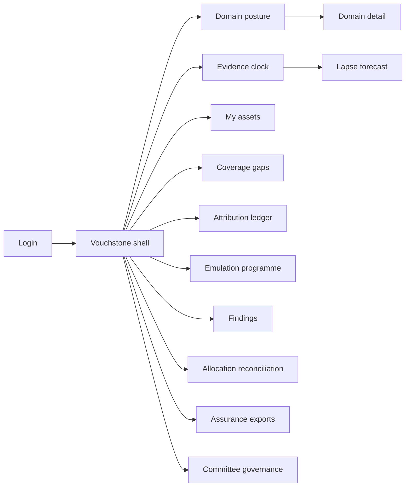
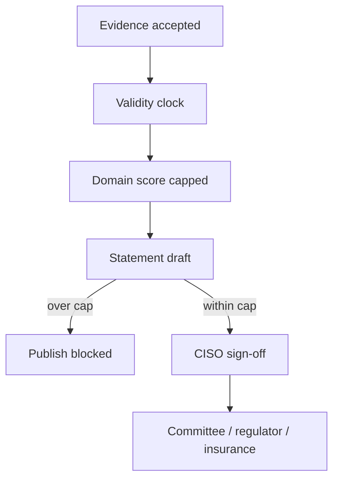

# Vouchstone — Web app

**Product:** [PRODUCT.md](./PRODUCT.md)
**Primary surface:** Evidenced cyber-assurance ledger (domain scores capped by dated evidence → board / regulator / insurance exports)
**Secondary surfaces:** Compartmented asset-owner attestation portal; committee governance console (decay rules & caps)
**Design thesis:** Vouchstone is a notarised ledger with a clock — confidence is earned, dated, and allowed to expire. The visual metaphor is a seal that cracks when evidence lapses: domain scores sit under glass only as high as their valid vouchers, and amber appears when the seal is due to fail, not when someone paints a new spider chart. Ground is deep ink-blue with parchment-warm evidence stamps and seal-red for lapsed claims; brand wordmark anchors every signed statement so the committee knows whose assurance they are reading.

## UX research synthesis

### Category peers (best-in-class)

- **ServiceNow Integrated Risk Management / GRC:** Control attestation workflows, evidence attachment, and board-ready risk statements. Steal: claim→evidence traceability in exports; reject evergreen green traffic lights that never decay.
- **RSA Archer / MetricStream:** Domain-based cyber programmes with policy ownership and audit testing. Steal: committee-owned policy vs operator-supplied evidence separation; reject annual self-scored maturity spiders as the hero view.
- **LogicGate Risk Cloud:** Configurable workflows for findings, owners, and due dates that suppress status until closed. Steal: open findings visibly depress related scores; reject disconnected “issue trackers” beside a pretty dashboard.
- **BitSight / SecurityScorecard (buyer-facing contrast):** Continuous external scores with decay when signals age. Steal: score movement driven by evidence freshness; reject external-only scoring as a substitute for internal assurance.

### Patterns to adopt / reject

- **Adopt:** Evidence-capped domain scores; automatic lapse; priority-asset attestation with location; detection coverage per named asset; discoverer attribution ledger; measured TTD distribution; allocation divergence finding; single-sourced triple export (committee / regulator / insurance); committee-owned decay rules.
- **Reject:** Self-scored maturity spiders that only improve; editable published scores; estate-wide browsable crown-jewel maps; survey-estimated time-to-detect; perimeter KPI vanity tiles; purple “AI confidence” gauges.

### Trust, density, and workflow constraints from PRODUCT.md

No user may publish above evidence (BR-1). Scores fall when evidence expires (BR-2) — politically hard, so decay ownership sits with the audit committee (BR-11). Priority assets + location are the denominator (BR-3, BR-4). Discovery share and measured TTD are standing metrics (BR-5, BR-6). Impact-vs-spend divergence is a finding, not a footnote (BR-7). Emulation is scheduled obligation (BR-8). Open findings suppress scores (BR-9). Three exports, one evidence base (BR-10). Asset/gap/exercise access is compartmented (BR-12).

## Information architecture

### Nav model

### Roles → default home

| Role | Default home | Why |
|------|--------------|-----|
| CISO / assurance lead | Domain posture + lapse forecast | Sign only what evidence supports (BR-1) |
| Security operations manager | Coverage gaps + TTD distribution | Per-asset coverage (BR-4, BR-6) |
| Adversary emulation lead | Emulation programme | Scheduled sparring (BR-8) |
| Business asset owner | My assets (compartmented) | Attest what/where (BR-3, BR-12) |
| Internal audit | Published statements test view | Score vs evidence on publish date |
| Insurance / legal liaison | Assurance exports | Claim-level traceability (BR-10) |
| Audit & risk committee chair | Committee governance | Own decay rules (BR-11) |

### Cross-links to OpenAPI resources

| Nav area | OpenAPI tags / resources |
|----------|---------------------------|
| Priority assets / attestations | Assets |
| Evidence items / validity | Evidence |
| Seven domain scores | Domains |
| Detection coverage / gaps | Coverage |
| Discoverer / TTD | Attribution |
| Emulation exercises | Exercises |
| Remediation / score suppression | Findings |
| Impact vs spend | Allocation |
| Statements / exports | Assurance |
| Decay rules / caps | Governance |

## Screen inventory

### Domain posture (home)

- **Purpose:** Show seven domains scored only up to evidence caps; forward view of upcoming lapses.
- **Entry:** CISO default; board prep deep link.
- **Layout regions:** Domain strip with capped scores; evidence-backed share vs asserted; next-two-quarters lapse forecast; open-finding suppression markers; divergence alert if allocation finding active; brand + statement draft status.
- **Primary actions:** Open domain; commission evidence; draft assurance statement.
- **Empty / loading / error:** Empty = baseline cycle framing (“establishing evidenced floor”); never fake greens.
- **BR / story ties:** BR-1, BR-2; CISO stories.

### Domain detail

- **Purpose:** Inspect supporting evidence, expiry dates, and what caps the score.
- **Entry:** Domain strip.
- **Layout regions:** Valid evidence list; lapsed items; open findings suppressing score; score ceiling explanation; propose-score (cannot exceed cap).
- **Primary actions:** Attach evidence; request re-attestation; open finding.
- **Empty / loading / error:** No valid evidence = score floored with explicit “uncapped claim blocked.”
- **BR / story ties:** BR-1, BR-2, BR-9.

### Evidence clock

- **Purpose:** Typed evidence with validity periods; automatic lapse drives score movement.
- **Entry:** Evidence nav; from lapse forecast.
- **Layout regions:** Timeline by expiry; type filters (exercise, attestation, third-party, spend); provenance; supersession chain.
- **Primary actions:** Accept evidence; mark superseded; export validity state at statement date.
- **Empty / loading / error:** Pending intake = queue for assurance lead.
- **BR / story ties:** BR-2; assurance lead stories.

### My assets (compartmented)

- **Purpose:** Owner-attested priority assets with location; re-attestation cycle; no estate-wide browse.
- **Entry:** Asset owner default; scoped CISO/ops views by claim.
- **Layout regions:** Owner’s asset list; location fields; attestation status; coverage and findings on *own* assets only; access-log notice.
- **Primary actions:** Attest / re-attest; update location; acknowledge gap.
- **Empty / loading / error:** Stale attestation = blocking banner for coverage claims on that asset.
- **BR / story ties:** BR-3, BR-12; asset owner stories.

### Detection coverage map

- **Purpose:** Coverage and named gaps per priority asset — not tool counts.
- **Entry:** Ops manager home; from asset.
- **Layout regions:** Asset-scoped coverage table; gap list; monitoring estate linkage; compartmented drill-down.
- **Primary actions:** Open gap; request detection change; export gap register for domain.
- **Empty / loading / error:** Missing detection-estate sync = coverage unknown (not 100%).
- **BR / story ties:** BR-4.

### Attribution ledger

- **Purpose:** Who discovered each successful attack; security function discovery share; measured TTD distribution.
- **Entry:** Attribution nav; committee pack preview.
- **Layout regions:** Incident rows with discoverer class; TTD histogram (months/years tail visible); discovery-share KPI; intake-time attribution lock.
- **Primary actions:** Confirm attribution at intake; export distribution; flag late attribution.
- **Empty / loading / error:** Unattributed confirmed incident = blocking incomplete state.
- **BR / story ties:** BR-5, BR-6; ops and committee secretary stories.

### Emulation programme

- **Purpose:** Schedule independent sparring over named assets; missed due date expires evidence.
- **Entry:** Emulation lead home.
- **Layout regions:** Calendar of exercises; provider; scope assets; outcome; auto-expiry on miss; findings spawned.
- **Primary actions:** Schedule; record outcome; accept findings into remediation.
- **Empty / loading / error:** Overdue exercise = evidence expired chrome on related domains.
- **BR / story ties:** BR-8, BR-9.

### Findings and remediation

- **Purpose:** Named owner, due date; unremediated findings suppress domain scores in-product.
- **Entry:** From exercise/incident/lapse; Findings nav.
- **Layout regions:** Open queue; score-suppression indicator; breach-of-due highlighting; closure sign-off.
- **Primary actions:** Assign owner; extend with logged reason; close with evidence.
- **Empty / loading / error:** Empty = healthy message with last closure date.
- **BR / story ties:** BR-9.

### Allocation reconciliation

- **Purpose:** Believed impact concentration vs actual control spend/effort; standing divergence finding.
- **Entry:** Allocation nav; CISO early view before committee.
- **Layout regions:** Dual chart (belief vs spend); divergence finding banner; finance-linked spend by domain.
- **Primary actions:** Explain divergence; raise finding; adjust investment plan link.
- **Empty / loading / error:** Missing finance feed = reconciliation incomplete.
- **BR / story ties:** BR-7.

### Assurance statement exports

- **Purpose:** One evidence base → committee pack, regulatory return, insurance proposal response with claim traces.
- **Entry:** Statements nav; after CISO sign-off.
- **Layout regions:** Draft claims; evidence links per claim; publish freeze of validity state; three export formats; signature block.
- **Primary actions:** Sign; export packs; verify claim→evidence.
- **Empty / loading / error:** Cap violation blocks publish (BR-1).
- **BR / story ties:** BR-10; assurance and insurance stories.

### Committee governance

- **Purpose:** Own decay rules, weightings, score caps; change-logged with approver.
- **Entry:** Committee-scoped role only.
- **Layout regions:** Rule editor; version history; impact preview on current scores; security-function read-only on rules.
- **Primary actions:** Approve rule change; roll back; publish.
- **Empty / loading / error:** Unauthorized edit attempt = hard deny + audit.
- **BR / story ties:** BR-11.

### Internal audit test view

- **Purpose:** Re-open published score vs evidence validity on publish date.
- **Entry:** Audit role.
- **Layout regions:** Statement picker; claim tests; pass/fail with immutable snapshot.
- **Primary actions:** Record audit finding on process; export test schedule.
- **Empty / loading / error:** No published statements yet.
- **BR / story ties:** Internal auditor stories.

## Key flows

1. **Evidence-capped publish** — gather evidence → score recomputes under caps → CISO signs → triple export; failure: lapsed evidence or open finding blocks claim height.

2. **Lapse forecast** — view next two quarters → commission exercise/attestation → prevent board amber surprise (CISO story).

3. **Incident attribution** — confirm successful attack → classify discoverer at intake → measure TTD → update discovery share (BR-5, BR-6).

4. **Missed emulation** — exercise due → not run → evidence expires → domain score falls → findings remain if any (BR-8).

5. **Committee rule change** — propose decay/cap change → committee approve with log → scores recompute; security cannot self-edit (BR-11).

## Design system

### Tokens (CSS variables)

- `--color-ink: #E9E6DF` — primary text on dark
- `--color-ground: #0B1220` — ink-blue ground
- `--color-panel: #141C2C` — panels
- `--color-rule: #2A3548` — dividers
- `--color-seal: #C4A574` — valid evidence / parchment seal
- `--color-seal-dim: #6E5A3C` — aging evidence
- `--color-lapse: #D4A017` — upcoming lapse
- `--color-crack: #C94C4C` — lapsed / publish blocked
- `--color-trust: #6A9B8A` — audit-pass / attested
- `--color-steel: #8F9BB0` — secondary labels
- `--color-brand: #D2C4A8` — Vouchstone wordmark
- `--font-display: "Libre Franklin", sans-serif` — titles and domain numerals
- `--font-mono: "IBM Plex Mono", monospace` — evidence ids, statement hashes, timestamps
- `--space-1`…`--space-8`: 4px scale
- `--radius-sm: 3px`; `--radius-md: 6px` — notarised-sharp
- `--motion-seal: 200ms ease-out` — evidence accept stamp
- `--motion-lapse: 360ms ease-in-out` — seal crack on expiry
- `--motion-suppress: 180ms` — finding suppression dip on score
- Atmosphere: subtle paper-grain in panels, soft vignette; no spider-chart hero; no purple AI glow.

### Typography & brand

- Display for domain scores and discovery-share; mono for evidence ids and export hashes.
- Brand wordmark on posture, statement, and export surfaces; never replaced by “Dashboard.”
- Login: brand-first; headline (“Confidence only as high as the evidence”); one CTA.

### Do / don’t

- **Do:** Cap scores by evidence; show expiry; compartment assets; measure TTD as distribution; single-source exports; committee-owned rules.
- **Don’t:** Maturity spiders that only rise; editable published scores; estate-wide crown-jewel browser; survey TTD; emoji status; rounded-full “AI confidence” pills.

### Accessibility & domain trust cues

- AA+ on seal/lapse/crack; score state also in text (Capped / Lapsing / Suppressed).
- Live regions for evidence expiry and publish blocks.
- Focus order: evidence → domain → statement → export.
- Access to sensitive asset/gap views always logged and announced to the user.

## Component patterns

- **EvidenceCappedScore** — domain numeral with ceiling and suppression markers.
- **ValidityClockRow** — typed evidence with expiry and lapse state.
- **LapseForecastStrip** — next-two-quarters cost-to-score.
- **AssetAttestationCard** — what/where/owner/re-attest (compartmented).
- **CoverageGapRow** — per priority asset gap.
- **DiscovererAttributionChip** — security / employee / authority / researcher / supplier / customer.
- **TtdDistribution** — histogram emphasising long tail.
- **AllocationDivergenceBanner** — standing impact-vs-spend finding.
- **ClaimTraceExport** — claim → evidence links for triple packs.
- **CommitteeRuleDiff** — logged governance change with approver.

## Out of scope for v1 web

- Continuous external attack-surface scoring as the assurance score; SOAR playbook execution; full CMDB replacement; public supplier portals; mobile-native board apps; AI chatbot that asserts posture without evidence; white-label consultancy maturity decks.
